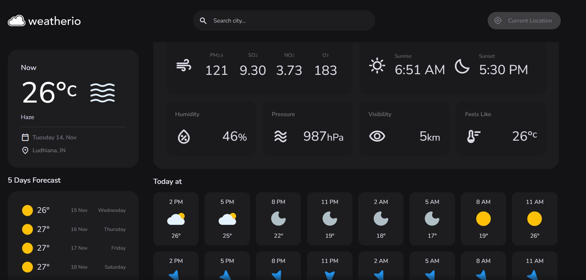

# Project Title

A brief description of what this project does and who it's for

## Tech Stack

**Client:** HTML, CSS, JavaScript, API

## Demo

Insert gif or link to demo

## Features

- Feature 1 - Weather forecast of any location in the world.
- Feature 2 - Weather forecast for the next 24 hours.
- Feature 3 - Additional information such as humidity, wind speed, mentioned in the project.
- Feature 4 - Graphic UI for the weather forecast.

## Screenshots



## Run Locally

Clone the project

```bash
  git clone https://link-to-project
```

Go to the project directory

```bash
  cd my-project
```

Open with VSCode

```bash
  code .
```

Open with live server

```bash
  npm run start
```
You can also install the Live Server extension in VSCode and click on "Go Live" at the bottom right corner of the screen.